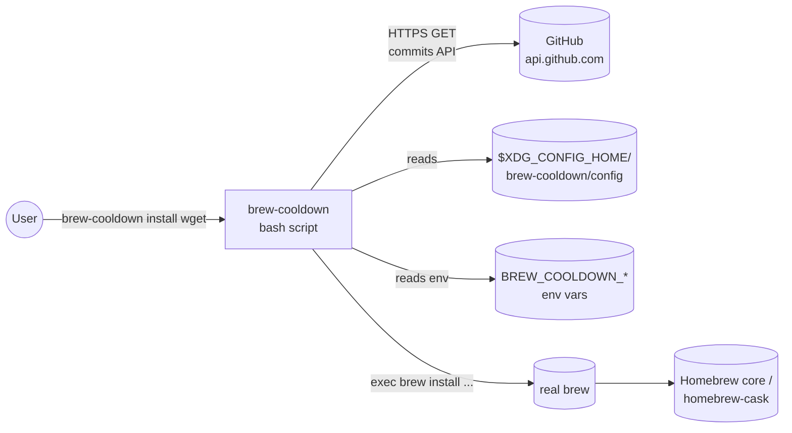
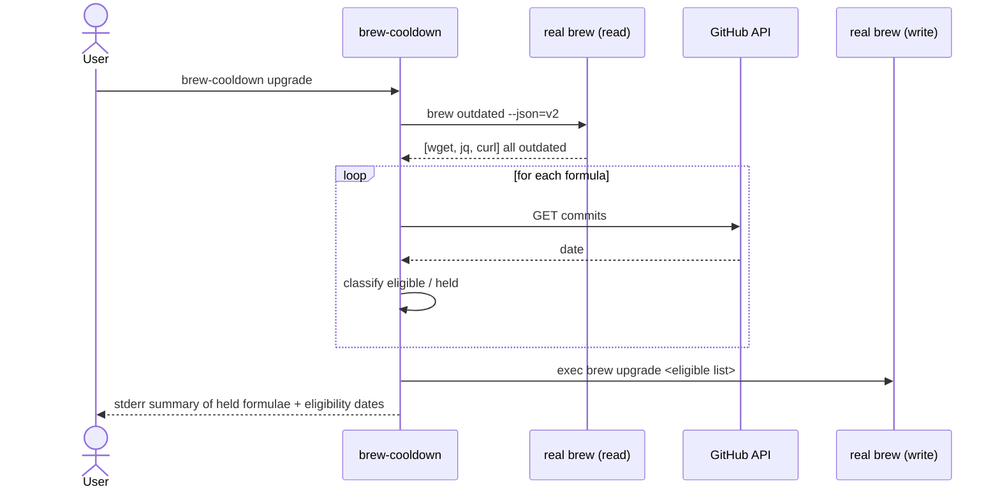

# brew-cooldown — architecture

A single Bash script (`bin/brew-cooldown`) sits between the user and the real `brew` binary. Before passing through `install` / `upgrade` / `reinstall`, it asks GitHub how old the current formula version is, and refuses if the answer is less than the configured cooldown.

## Context diagram



## Sequence — eligible install (happy path)

```mermaid
sequenceDiagram
  actor User
  participant BC as brew-cooldown
  participant GH as GitHub API
  participant Brew as real brew

  User->>BC: brew-cooldown install wget
  BC->>BC: validate_formula_name("wget")
  BC->>BC: load_config + env + flags
  BC->>GH: GET /repos/Homebrew/homebrew-core/commits<br/>?path=Formula/w/wget.rb&per_page=1
  GH-->>BC: 200, commit.committer.date = 2026-01-15T...
  BC->>BC: age_days = 112; cooldown = 7; 112 >= 7 -> eligible
  BC->>Brew: exec brew install wget
  Brew-->>User: (real brew output)
```

## Sequence — held install

```mermaid
sequenceDiagram
  actor User
  participant BC as brew-cooldown
  participant GH as GitHub API

  User->>BC: brew-cooldown upgrade wget
  BC->>BC: validate_formula_name("wget")
  BC->>GH: GET commits ?path=Formula/w/wget.rb
  GH-->>BC: 200, commit.committer.date = (1 day ago)
  BC->>BC: age = 1; cooldown = 7; held
  BC-->>User: stderr: "wget held: eligible after 2026-05-13T...; exit 1"
```

## Sequence — fail-closed on network error

```mermaid
sequenceDiagram
  actor User
  participant BC as brew-cooldown
  participant GH as GitHub API

  User->>BC: brew-cooldown install wget
  BC->>GH: GET commits
  GH--xBC: connection reset
  alt BREW_COOLDOWN_FAIL_OPEN unset (default)
    BC-->>User: stderr: "fail-closed: ..." ; exit 2
  else BREW_COOLDOWN_FAIL_OPEN=1
    BC-->>User: warn + exec brew install wget
  end
```

## Sequence — `upgrade` with no args



## Module breakdown (`bin/brew-cooldown`)

The script is one file but logically partitioned. Each block is independently unit-testable when sourced with `BREW_COOLDOWN_LIB_ONLY=1`.

```
bin/brew-cooldown
├── prelude        set -euo pipefail; IFS; lib-mode early return
├── logging        log_info / log_warn / log_error / die / mask_token
├── config         load_config (allowlist-parse, never source)
├── validation     validate_formula_name
├── repo paths     repo_path_for (formula vs cask, font-prefix special case)
├── network        fetch_latest_commit_date (curl + jq, rate-limit detection)
├── time           iso_to_epoch (macOS + Linux), age_days
├── decision       check_cooldown (orchestrator)
├── commands       cmd_install, cmd_upgrade (one and many), cmd_reinstall
├── usage          usage / unsupported-subcommand handler
└── main           flag parsing, dispatch
```

## Data flow

1. **Input** — `argv` from user, env vars, optional config file
2. **Validate** — formula name regex, parse flags, resolve cooldown days
3. **Lookup** — `repo_path_for(name, kind)` → e.g., `Formula/w/wget.rb`
4. **Fetch** — `curl https://api.github.com/repos/Homebrew/homebrew-core/commits?path=...&per_page=1`
5. **Parse** — `jq -r '.[0].commit.committer.date // empty'`
6. **Compute** — `age_days = (now_epoch - commit_epoch) / 86400`
7. **Decide** — `age_days >= cooldown_days` → eligible, else held
8. **Act** — eligible: `exec command brew <subcmd> <args>`; held: stderr + exit 1; error: fail-closed unless `FAIL_OPEN=1`

## Why Bash

See [`adr/0001-language-bash.md`](adr/0001-language-bash.md). Short version: zero install friction on macOS, single auditable file, matches the Homebrew ecosystem's own implementation language.

## Why GitHub commits API

See [`adr/0002-data-source-github-commits.md`](adr/0002-data-source-github-commits.md). Short version: `formulae.brew.sh/api` doesn't expose version release timestamps; `brew log` is unreliable under modern `HOMEBREW_INSTALL_FROM_API`. The commits API on `homebrew-core` is the simplest authoritative source.

## Why latest-commit-date heuristic

See [`adr/0004-version-heuristic-latest-commit.md`](adr/0004-version-heuristic-latest-commit.md). Short version: simpler than walking commits to find the version-bump commit, conservative-safe (over-rejects rather than under-rejects when a non-version commit happens after the version bump).
